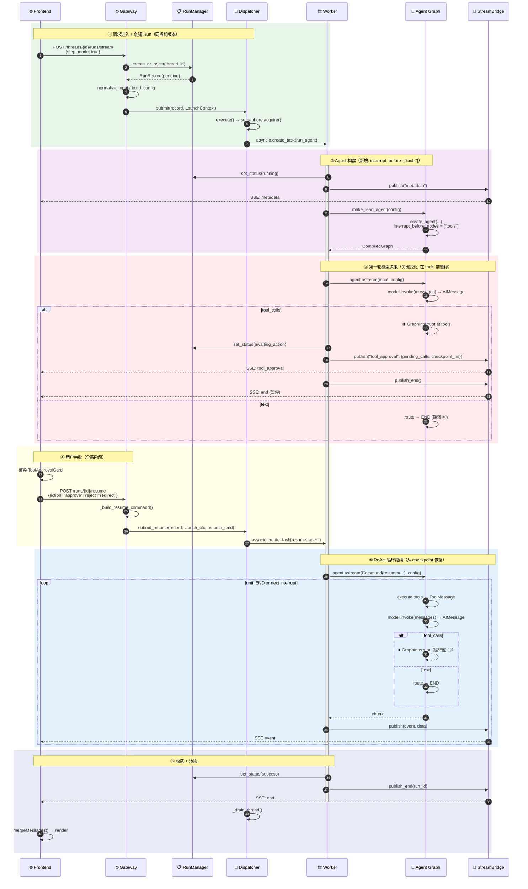

# DeerFlow 主链路时序图（多轮对话版）

> 改造目标：从「一个 Run = 完整 ReAct loop」变为「每步决策用户可见可干预」的持续对话。

## 流程说明

核心变化：Agent Graph 在 **每次工具执行前暂停**（`interrupt_before=["tools"]`），将工具调用暴露给用户审批，用户可选择批准/拒绝/重定向后再继续。与图中 `autonumber` 编号对应：

### ① 请求进入 + 创建 Run（步骤 1-8）
与当前版本相同：Gateway 校验 → RunManager 创建 RunRecord → Dispatcher 调度 → Worker 启动，但请求中多带一个 `context.step_mode = true`，触发后续的暂停逻辑。

### ② Agent 构建（步骤 9-14）
Worker 构建 Agent Graph 时，检测到 `step_mode=True`，自动设置 `agent.interrupt_before_nodes = ["tools"]`。这意味着每当模型产出 tool_calls，Graph 会在执行工具之前暂停。

### ③ ReAct 第一轮：模型决策（步骤 15-19）
模型产出 AIMessage。如果包含 **tool_calls**：
- Graph 在 tools 节点前触发 **GraphInterrupt**
- Worker 捕获该异常，设置状态为 `awaiting_action`
- 推送 `tool_approval` SSE 事件（含待审批工具列表 + checkpoint_ns）
- Run 暂停，但 RunRecord 保持活跃，等待用户决策

如果是纯文本，则直接 route → END，跳转到 ⑥。

### ④ 用户审批（步骤 20-22，新增阶段）
前端渲染 ToolApprovalCard，用户可选：
- **批准**：`POST /runs/{id}/resume { action: "approve" }`
- **拒绝**：`POST /runs/{id}/resume { action: "reject", rejection_reason: "..." }`
- **重定向**：`POST /runs/{id}/resume { action: "redirect", user_message: "..." }`

Gateway 调用 `Worker.resume_agent()`，使用 LangGraph `Command(resume=...)` 从 checkpoint 恢复执行。

### ⑤ ReAct 循环继续（步骤 23-29）
恢复后工具执行 → 结果反馈给模型 → 模型继续推理。可能再次遇到 tool_calls（循环回 ③ 再次暂停），也可能产出纯文本（route → END）。

### ⑥ 收尾 + 渲染（步骤 30-34）
与当前版本相同：更新状态 → 推送 end → 前端渲染。

### 关键差异：如果用户发送新消息而非审批

用户在 `awaiting_action` 时发新消息 → 自动 reject 当前待审批工具 + 注入新消息 → 模型基于新消息重新推理。

## 时序图



## 与当前版本 Diff

### 时序图差异

```
当前版本:                             多轮对话版:
─────────                             ──────────
① 请求+调度                           ① 请求+调度（同）
② Agent 构建                          ② Agent 构建（+interrupt_before）
③ ReAct 循环（内部完成，不暂停）        ③ 第一轮模型决策 → ⏸️ 暂停
  模型⇄工具⇄模型⇄...→END              ④ 用户审批 ← 全新阶段
④ 收尾+渲染                           ⑤ ReAct 继续（从 checkpoint 恢复）
                                      ⑥ 收尾+渲染
```

### 组件变更

| | 当前版本 | 多轮对话版 |
|---|---|---|
| **Run 生命周期** | pending→running→success/error | + `awaiting_action` 中间态 |
| **工具执行** | 自动连续执行 | 每批工具执行前暂停，用户审批 |
| **Agent Graph** | `interrupt_before` 不使用 | `interrupt_before_nodes = ["tools"]` |
| **Worker** | `run_agent()` 一次执行到底 | + `resume_agent()` 从 checkpoint 恢复 |
| **StreamBridge** | metadata / values / messages / error / end | + `tool_approval` 事件 |
| **Gateway API** | POST /runs/stream | + POST /runs/{id}/resume |
| **Dispatcher** | submit() | + submit_resume() |
| **前端** | 流式消息展示 | + ToolApprovalCard + 审批交互 |

### 新增文件

| 文件 | 用途 |
|------|------|
| `runtime/runs/tool_approval.py` | PendingToolCall, ToolApprovalState 数据模型 |
| `frontend/.../tool-approval-card.tsx` | 工具审批卡片组件 |
| `frontend/src/core/conversation/hooks.ts` | useConversationStream hook |

### 不变部分

- Checkpointer / ThreadState Schema
- 18 个中间件链
- Sandbox / Subagent / MCP / Skills
- StreamBridge 基础架构
- ThreadRunQueue 排队机制
- Summarization / Memory 系统
- IM Channel 集成（继续使用自主模式）
