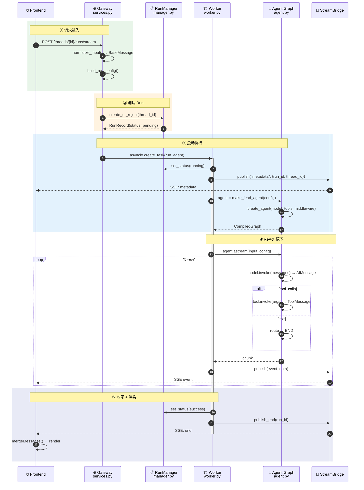

# DeerFlow 主链路时序图（无 Dispatcher 版本）

> 开发 Dispatcher 之前的流程：有 RunManager 管理生命周期，但无并发调度、无排队。

## 流程说明

Dispatcher 是后来加的调度层。在此之前，RunManager 已存在，负责 Run 的创建和状态管理，但 Gateway 直接启动 Worker——没有并发控制（Semaphore）、没有排队（ThreadRunQueue）、没有 per-thread Lock。整个流程分为 **5 个阶段**，与图中 `autonumber` 编号对应：

### ① 请求进入（步骤 1-3）
前端发起 HTTP 请求，Gateway 做两件事：`normalize_input()` 把用户消息转为 LangChain BaseMessage，`build_run_config()` 构建包含 thread_id 的 RunnableConfig。

### ② 创建 Run（步骤 4-5）
Gateway 调用 `RunManager.create_or_reject()`，检查线程是否已有正在执行的 Run（有则 409），无则创建 RunRecord(status=pending)。

### ③ 启动执行（步骤 6-10）
Gateway 直接通过 `asyncio.create_task()` 启动 Worker——**没有 Dispatcher**。Worker 更新状态为 running，推送 metadata SSE 事件，然后调用 `make_lead_agent()` 构建 Agent Graph。

### ④ ReAct 循环（步骤 11-17，循环直到 END）
模型推理 → 工具执行 → 结果反馈 → 继续推理，直到产出纯文本。每步通过 StreamBridge → SSE 实时推前端。

### ⑤ 收尾 + 渲染（步骤 18-21）
Worker 更新 Run 状态为 success，推送 `end` 事件关闭 SSE。前端 `mergeMessages()` 合并渲染。

## 架构特点

- **有 Run 生命周期**：RunManager 管理 RunRecord，但无持久化到 RunStore
- **无并发控制**：一个线程同时只能有一个 Run，第二个请求直接 409
- **无排队**：没有 ThreadRunQueue，冲突即拒绝
- **Gateway 直连 Worker**：Gateway 承担了 Dispatcher 的角色（创建后台 Task）
- **适用场景**：单用户、低并发，Dispatcher 开发前的过渡阶段

## 与当前版本差异

| 组件 | 无 Dispatcher | 有 Dispatcher |
|------|:--:|:--:|
| RunManager | ✅ 有（生命周期） | ✅ 有 |
| RunDispatcher | ❌ 无 | ✅ 有 |
| ThreadRunQueue | ❌ 无 | ✅ 有 |
| 并发 Semaphore | ❌ 无 | ✅ 有（max 4） |
| per-thread Lock | ❌ 无 | ✅ 有 |
| enqueue 策略 | ❌ 无 | ✅ 有 |
| RunStore 持久化 | ❌ 无 | ✅ 有 |

## 时序图

