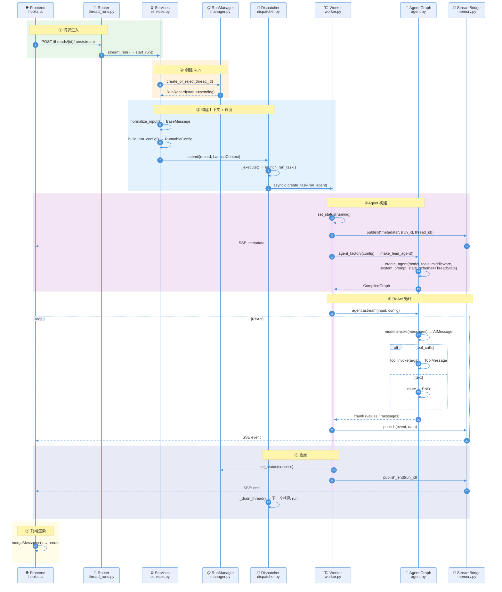

# DeerFlow 主链路时序图

## 流程说明

整个链路分为 **7 个阶段**，与图中 `autonumber` 编号对应：

### ① 请求进入（步骤 1-2）
前端发起 `POST /threads/{id}/runs/stream`，Router 校验权限后交给 Services。

### ② 创建 Run（步骤 3-4）
Services 调用 `RunManager.create_or_reject()`，检查线程冲突（策略：reject / enqueue / interrupt / rollback），创建 RunRecord。

### ③ 构建上下文 + 调度（步骤 5-9）
Services 将用户消息转为 BaseMessage → 构建 RunnableConfig（thread_id、model_name 等）→ 打包 LaunchContext → 提交 Dispatcher。Dispatcher 获取 per-thread Lock 后，通过 asyncio.Task 将 run 交给 Worker。

### ④ Agent 构建（步骤 10-16）
Worker 启动后：更新状态为 running → 推送 metadata SSE 事件 → 调用 `make_lead_agent()` 构建 Agent Graph（模型选择 + 工具加载 + 18 中间件组装 + 系统提示词）→ 启动 `agent.astream()`。

### ⑤ ReAct 循环（步骤 17-23，循环直到 END）
Agent Graph 进入经典 ReAct 循环：
- **Reason**：`model.invoke(messages)` → AIMessage（含 tool_calls 或纯文本）
- **Act**：有 tool_calls → 执行工具 → ToolMessage 反馈；纯文本 → route → END
- 每步结果通过 `publish()` → SSE 实时推前端

### ⑥ 收尾（步骤 24-27）
`set_status(success)` → `publish_end()` 关闭 SSE → Dispatcher `_drain_thread()` 启动下一个排队 run。

### ⑦ 前端渲染（步骤 28）
`mergeMessages()` 合并历史 + 流式 + 乐观消息，去重后渲染到界面。

---

## 时序图

---
| 模块 | 文件 | 核心方法 |
|------|------|---------|
| Frontend | `frontend/src/core/threads/hooks.ts` | `mergeMessages()` |
| Router | `backend/app/gateway/routers/thread_runs.py` | `stream_run()` |
| Services | `backend/app/gateway/services.py` | `start_run()`, `normalize_input()`, `build_run_config()` |
| RunManager | `backend/.../runtime/runs/manager.py` | `create_or_reject()`, `set_status()` |
| Dispatcher | `backend/.../runtime/runs/dispatcher.py` | `submit()`, `_execute()`, `_drain_thread()` |
| Worker | `backend/.../runtime/runs/worker.py` | `run_agent()` |
| Agent Graph | `backend/.../agents/lead_agent/agent.py` | `make_lead_agent()`, `create_agent()`, `astream()` |
| StreamBridge | `backend/.../runtime/stream_bridge/memory.py` | `publish()`, `publish_end()` |
