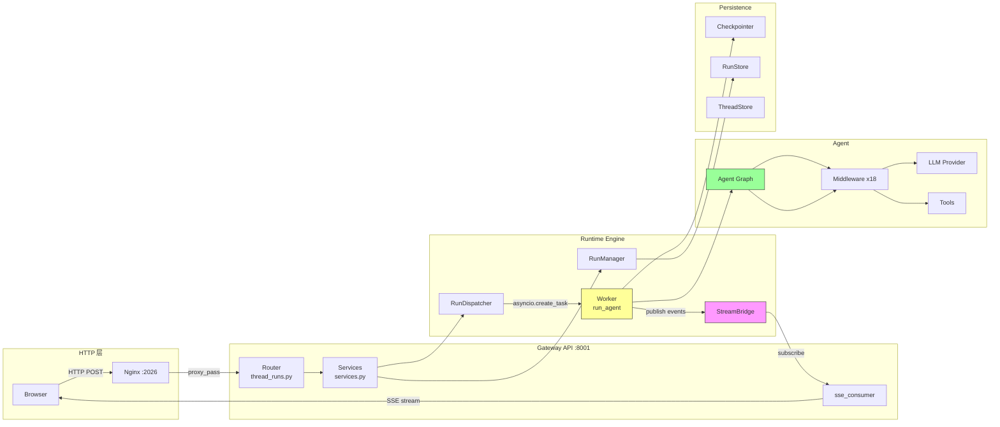
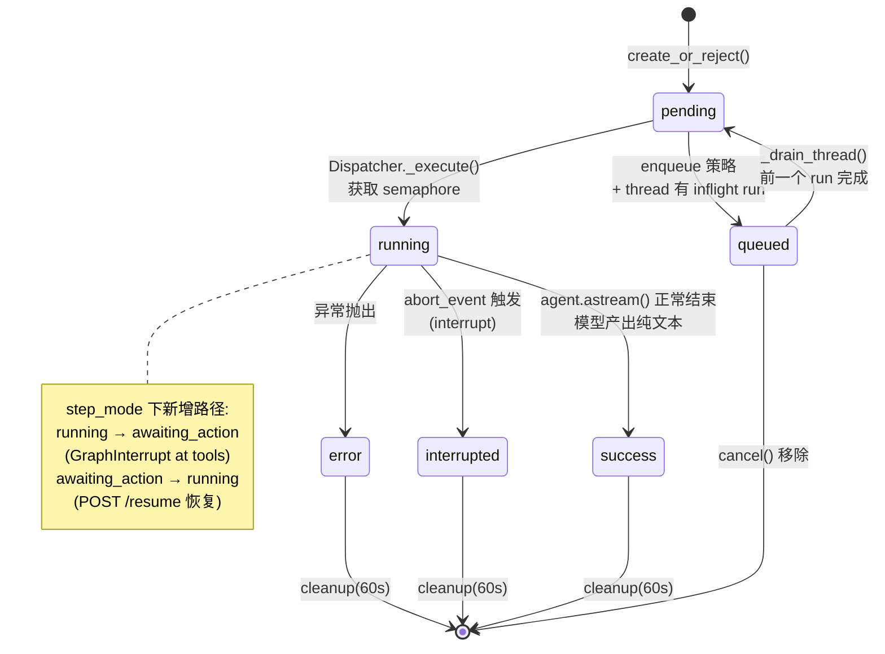
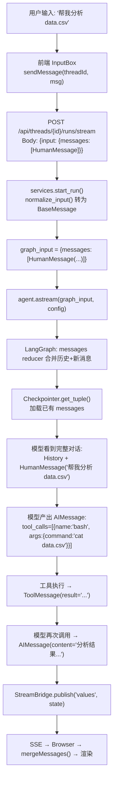
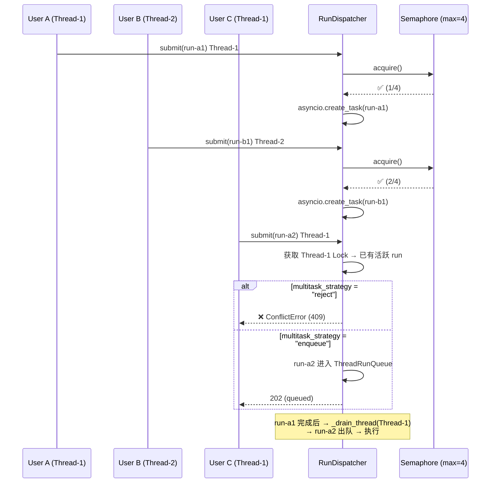

# DeerFlow 主链路时序图

## 完整请求 → 响应流程

```mermaid
sequenceDiagram
    autonumber

    participant Browser as 🌐 Browser (Next.js)
    participant Nginx as 🔀 Nginx :2026
    participant Router as 🚪 Gateway Router<br/>thread_runs.py
    participant Services as ⚙️ Services<br/>services.py
    participant RunMgr as 📋 RunManager<br/>manager.py
    participant RunStore as 💾 RunStore<br/>(SQLite)
    participant Dispatcher as 📡 RunDispatcher<br/>dispatcher.py
    participant Worker as 🏗️ Worker<br/>worker.py
    participant Agent as 🧠 Agent Graph<br/>make_lead_agent()
    participant Middleware as 🔗 Middleware Chain<br/>(18 middlewares)
    participant LLM as 🤖 LLM Provider
    participant Tools as 🔧 Tools<br/>(bash/read/write/...)
    participant Checkpointer as 📝 Checkpointer<br/>(SQLite)
    participant Bridge as 🌉 StreamBridge<br/>(Memory)
    participant Frontend as 🖥️ Frontend Hooks<br/>useThreadStream()

    %% ============================================================
    %% Phase 1: Request Initiation
    %% ============================================================

    Browser->>Browser: 用户输入消息 + 点击发送
    Browser->>Browser: useThreadStream().sendMessage()

    Browser->>Nginx: POST /api/threads/{thread_id}/runs/stream
    Note over Browser,Nginx: { input: {messages: [...]}, stream_mode: ["values","messages-tuple"] }

    Nginx->>Router: POST /api/threads/{thread_id}/runs/stream
    Note over Nginx,Router: 路径重写: /api/langgraph/* → /api/*

    %% ============================================================
    %% Phase 2: Request Validation
    %% ============================================================

    activate Router
    Router->>Router: 解析 RunCreateRequest (Pydantic)
    Router->>Router: CSRF 校验
    Router->>Router: 权限校验 (require_permission)
    Router->>Router: 提取 stream_mode, multitask_strategy, on_disconnect
    deactivate Router

    Router->>Services: await start_run(body, thread_id, request)

    %% ============================================================
    %% Phase 3: Run Creation
    %% ============================================================

    activate Services
    Services->>Services: 从 app.state 获取单例:<br/>bridge, run_mgr, run_ctx, dispatcher

    Services->>Services: 解析 model_name, 验证是否在允许列表
    Services->>Services: 解析 on_disconnect (cancel/continue)
    Services->>Services: 解析 multitask_strategy (reject/interrupt/rollback/enqueue)

    Services->>RunMgr: await create_or_reject(thread_id, assistant_id, ...)
    activate RunMgr

    RunMgr->>RunMgr: 检查 thread 是否有 inflight run

    alt multitask_strategy = "reject" 且有 inflight run
        RunMgr-->>Services: ❌ ConflictError → HTTP 409
    else multitask_strategy = "enqueue" 且有 inflight run
        RunMgr->>RunMgr: 创建 RunRecord(status=queued)
        RunMgr->>RunMgr: 加入 ThreadRunQueue
    else interrupt / rollback
        RunMgr->>RunMgr: cancel 现有 run (set abort_event)
        RunMgr->>RunMgr: 创建新 RunRecord(status=pending)
    else 无 inflight run
        RunMgr->>RunMgr: 创建 RunRecord(status=pending, run_id=uuid4)
    end

    RunMgr->>RunStore: 持久化 RunRecord → runs 表
    RunStore-->>RunMgr: ✅
    RunMgr-->>Services: record (RunRecord)

    deactivate RunMgr

    %% 如果 queued，直接返回 202
    opt record.status == queued
        Services-->>Router: record (queued)
        Router-->>Nginx: 202 { run_id, status: "queued" }
        Nginx-->>Browser: 202 + 前端轮询等待
    end

    %% ============================================================
    %% Phase 4: Build Execution Context
    %% ============================================================

    Services->>Services: upsert thread_meta (display_name, status="running")
    Services->>Services: resolve_agent_factory() → make_lead_agent
    Services->>Services: normalize_input() → dict → BaseMessage 对象
    Services->>Services: build_run_config() → RunnableConfig
    Note over Services: config.configurable.thread_id = thread_id
    Services->>Services: merge_run_context_overrides()<br/>(model_name, thinking_enabled, is_plan_mode, ...)
    Services->>Services: inject_authenticated_user_context()<br/>(config.context.user_id)
    Services->>Services: normalize_stream_modes() → ["values","messages-tuple"]

    Services->>Services: 构建 LaunchContext
    Note over Services: { bridge, run_ctx, run_mgr, agent_factory,<br/>  graph_input, config, stream_modes,<br/>  interrupt_before, interrupt_after }

    Services->>Dispatcher: await dispatcher.submit(record, launch_ctx)
    deactivate Services

    %% ============================================================
    %% Phase 5: Dispatch & Schedule
    %% ============================================================

    activate Dispatcher
    Dispatcher->>Dispatcher: 存储 launch_ctxs[run_id] = launch_ctx
    Dispatcher->>Dispatcher: 获取 per-thread Lock
    Dispatcher->>Dispatcher: 标记 thread 为 active
    Dispatcher->>Dispatcher: asyncio.create_task(_execute(record))
    deactivate Dispatcher

    Note over Dispatcher: submit() 立即返回，不阻塞

    activate Dispatcher
    Dispatcher->>Dispatcher: async with semaphore (max 4 workers)
    Dispatcher->>Dispatcher: 从 _launch_contexts 获取 launch_ctx
    Dispatcher->>Services: await launch(record, launch_ctx)
    Note over Dispatcher,Services: launch = services.launch_run_task

    activate Services
    Services->>Worker: task = asyncio.create_task(run_agent(...))
    Services->>RunMgr: record.task = task
    Services-->>Dispatcher: ✅
    deactivate Services

    Dispatcher->>Dispatcher: await record.task (等待 run_agent 完成)
    Note over Dispatcher: 异步等待，不阻塞调度器
    deactivate Dispatcher

    %% ============================================================
    %% Phase 6: Worker - run_agent()
    %% ============================================================

    activate Worker
    Worker->>Worker: 创建 RunJournal (LangChain CallbackHandler)
    Worker->>RunMgr: set_status(run_id, "running")
    Worker->>Checkpointer: 捕获 pre-run checkpoint 快照
    Note over Worker,Checkpointer: 用于 rollback 恢复

    Worker->>Bridge: publish("metadata", {run_id, thread_id})
    Bridge-->>Frontend: SSE event: metadata

    Worker->>Worker: 构建 Runtime 对象
    Note over Worker: { thread_id, run_id, app_config,<br/>  __run_journal, __checkpointer }

    Worker->>Worker: 注入 Runtime context → config
    Worker->>Worker: 注入 Langfuse trace metadata
    Worker->>Worker: 设置 run_name (LangSmith)

    %% ============================================================
    %% Phase 7: Agent Graph Construction
    %% ============================================================

    Worker->>Agent: agent = agent_factory(config)
    Note over Worker,Agent: agent_factory = make_lead_agent

    activate Agent
    Agent->>Agent: _resolve_model_name(requested_model)
    Agent->>Agent: create_chat_model(name, thinking_enabled)
    Agent->>Agent: get_available_tools(groups, mcp, model, subagent)
    Note over Agent: 工具来源:<br/>- Sandbox (bash, ls, read_file, write_file, str_replace)<br/>- MCP servers<br/>- Built-in (present_files, ask_clarification, view_image)<br/>- Community (tavily, jina_ai, firecrawl)<br/>- Subagent (task)
    Agent->>Agent: filter_tools_by_skill_allowed_tools()
    Agent->>Agent: apply_prompt_template() → system_prompt
    Agent->>Agent: _build_middlewares() → 18 个中间件链
    Agent->>Agent: create_agent(model, tools, middleware, system_prompt, state_schema=ThreadState)
    Note over Agent: 返回 CompiledGraph (Runnable)
    Agent-->>Worker: agent (CompiledGraph)
    deactivate Agent

    Worker->>Worker: agent.checkpointer = checkpointer
    Worker->>Worker: agent.store = store
    Worker->>Worker: agent.interrupt_before_nodes = interrupt_before

    %% ============================================================
    %% Phase 8: Graph Execution & Streaming
    %% ============================================================

    Worker->>Worker: 构建 stream_mode 列表
    Note over Worker: "messages-tuple" → LangGraph "messages"<br/>"values" → "values"<br/>"custom" → "custom"

    loop agent.astream() 主循环
        Worker->>Agent: async for chunk in agent.astream(graph_input, config, stream_mode)

        activate Agent
        Agent->>Middleware: State → BeforeModel hooks
        activate Middleware

        Note over Middleware: 1. DynamicContextMiddleware: 注入日期/记忆<br/>2. ViewImageMiddleware: 注入 base64 图片<br/>3. SummarizationMiddleware: 检查 token 上限

        Middleware->>LLM: model.invoke(messages, tools)
        activate LLM
        LLM-->>Middleware: AIMessage (text / tool_calls)
        deactivate LLM

        Middleware->>Middleware: AfterModel hooks
        Note over Middleware: 16. SubagentLimitMiddleware: 截断过多 task 调用<br/>17. LoopDetectionMiddleware: 检测循环<br/>10. TodoMiddleware: 检查 todo 完成状态

        alt AIMessage 包含 tool_calls
            Middleware->>Middleware: BeforeTool hooks
            Note over Middleware: 6. GuardrailMiddleware: 授权检查<br/>7. SandboxAuditMiddleware: 安全审计

            Middleware->>Tools: tool.invoke(args)
            activate Tools
            Note over Tools: bash / read_file / write_file / task(subagent) / ...
            Tools-->>Middleware: ToolMessage (result)
            deactivate Tools

            Middleware->>Middleware: AfterTool hooks
            Note over Middleware: 8. ToolErrorHandlingMiddleware: 异常→ToolMessage

            Middleware-->>Agent: State (含 ToolMessage)
            Note over Agent,Middleware: Graph 循环回 model 节点
        else AIMessage 纯文本（无 tool_calls）
            Middleware-->>Agent: State (含最终文本)
            Note over Agent,Middleware: Graph route → END
        end
        deactivate Middleware

        Agent-->>Worker: chunk (mode, data)
        deactivate Agent

        Worker->>Worker: 检查 record.abort_event (用户取消?)

        Worker->>Bridge: bridge.publish(run_id, sse_event, serialize(chunk))

        alt mode = "values"
            Bridge-->>Frontend: event: values<br/>data: { messages, title, artifacts, todos, ... }
        else mode = "messages"
            Bridge-->>Frontend: event: messages<br/>data: [ (AIMessageChunk | ToolMessage), ... ]
        else mode = "custom"
            Bridge-->>Frontend: event: custom<br/>data: { ... }
        end
    end

    %% ============================================================
    %% Phase 9: Finalization
    %% ============================================================

    alt abort_event.is_set() + action="rollback"
        Worker->>RunMgr: set_status(run_id, "error")
        Worker->>Checkpointer: _rollback_to_pre_run_checkpoint()
    else abort_event.is_set() + action="interrupt"
        Worker->>RunMgr: set_status(run_id, "interrupted")
    else 正常完成
        Worker->>RunMgr: set_status(run_id, "success")
    end

    Worker->>Worker: journal.flush() → 持久化 events
    Worker->>Worker: update_run_completion(token_usage, message_count)
    Worker->>RunStore: 写入 runs 表 (tokens, messages, status)

    Worker->>Checkpointer: aget_tuple() → 读取最终 title
    Worker->>Worker: thread_store.update_display_name(title)

    Worker->>Worker: thread_store.update_status(thread_id, "idle"|"error")

    Worker->>Bridge: bridge.publish_end(run_id)
    Bridge-->>Frontend: event: end
    Note over Bridge,Frontend: 流结束信号

    Worker->>Bridge: asyncio.create_task(bridge.cleanup(run_id, delay=60))
    Worker->>Dispatcher: run_manager.notify_run_terminal(thread_id, run_id)
    deactivate Worker

    %% ============================================================
    %% Phase 10: Post-Run Cleanup
    %% ============================================================

    activate Dispatcher
    Dispatcher->>Dispatcher: on_run_finished(thread_id, run_id)
    Dispatcher->>Dispatcher: 弹出 _launch_contexts[run_id]
    Dispatcher->>Dispatcher: _drain_thread(thread_id)
    Note over Dispatcher: 从 ThreadRunQueue 取下一个 run<br/>如果没有，释放 thread lock
    deactivate Dispatcher

    %% ============================================================
    %% Phase 11: Frontend Rendering
    %% ============================================================

    Frontend->>Frontend: mergeMessages(history, thread, optimistic)
    Frontend->>Frontend: dedupeMessagesByIdentity()
    Frontend->>Frontend: getMessageGroups()
    Frontend->>Frontend: 渲染 MessageList
    Note over Frontend: 工具调用展开/折叠<br/>思考过程 (reasoning)<br/>Artifact 列表<br/>流式指示器消失

    Frontend->>Frontend: useStream 设置 isLoading = false

    Browser->>Browser: 🎉 用户看到完整回复
```

---

## 关键组件通信矩阵

---

## Run 状态机

---

## 数据流：一条消息如何贯穿各层

---

## 并发模型

---
┌──────────────┬─────────────────────────────────────────────────────────────────────────────────────────────────────────────────────────────────────────────────────────┐
  │      图      │                                                                          内容                                                                           │
  ├──────────────┼─────────────────────────────────────────────────────────────────────────────────────────────────────────────────────────────────────────────────────────┤
  │ 主时序图     │ 11 个阶段、从 Browser → Nginx → Gateway → RunManager → Dispatcher → Worker → Agent Graph → Middleware → LLM → Tools → StreamBridge → 前端渲染的完整链路 │
  ├──────────────┼─────────────────────────────────────────────────────────────────────────────────────────────────────────────────────────────────────────────────────────┤
  │ 组件通信矩阵 │ 各组件之间的调用关系图（HTTP 层 / Gateway / Runtime / Agent / Persistence 五层）                                                                        │
  ├──────────────┼─────────────────────────────────────────────────────────────────────────────────────────────────────────────────────────────────────────────────────────┤
  │ Run 状态机   │ pending → running → success/error/interrupted 状态转换，含 step_mode 新增 awaiting_action                                                               │
  ├──────────────┼─────────────────────────────────────────────────────────────────────────────────────────────────────────────────────────────────────────────────────────┤
  │ 数据流       │ 一条消息 "帮我分析 data.csv" 从用户输入到最终渲染在各层的转换过程                                                                                       │
  ├──────────────┼─────────────────────────────────────────────────────────────────────────────────────────────────────────────────────────────────────────────────────────┤
  │ 并发模型     │ 两个用户、三个请求的并发调度示意（reject vs enqueue 策略）                                                                                              │
  └──────────────┴─────────────────────────────────────────────────────────────────────────────────────────────────────────────────────────────────────────────────────────┘
