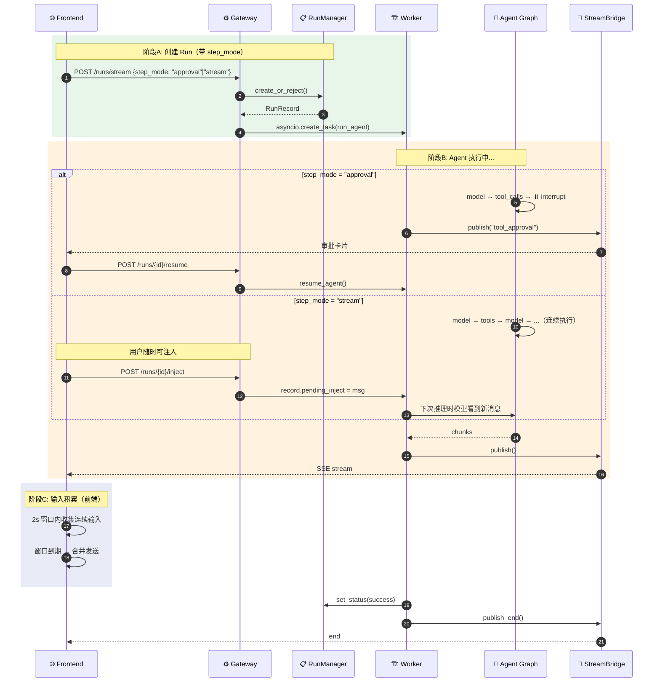

# DeerFlow 多轮对话改造 — 二期

> 一期（`多轮对话改造计划.md`）实现了基础的 step_mode：工具执行前暂停 + 用户审批/拒绝/重定向。
> 二期解决更复杂的多轮交互场景：运行中注入、输入合并、差异化暂停。

---

## 场景分析

| # | 场景 | 一期能覆盖？ | 缺口 |
|---|------|:--:|------|
| 二 | 修改任务参数（"不看上个月看这个月"） | ⚠️ | `awaiting_action` 时可 redirect，但工具执行中无法注入 |
| 三 | 停止任务（"算了不查了"） | ✅ | cancel + abort_event 已有 |
| 四 | 垫词后打断+调整（运行中补充信息） | ❌ | 工具需连续执行，用户中途注入新消息 |
| 五 | 连续输入合并（三条消息合并一个任务） | ❌ | 一个消息=一个 Run，无合并机制 |
| 六 | 快速响应（"你有啥功能"） | ✅ | 纯文本无 tool_calls，天然支持 |

**二期重点：解决二、四、五。**

---

## 补充设计

### 1. 运行中消息注入

**目标**：Run 处于 `running` 状态时，用户发送新消息不创建新 Run，而是注入到正在执行的 Graph。

#### 核心思路

当前 Worker 通过 `agent.astream()` 驱动 Graph，这是一个单向流。要实现运行中注入，需要在 Graph 执行期间向消息通道写入新消息。

LangGraph 支持通过 `Command` 在 graph 执行中注入消息，但 `astream()` 在循环中无法直接接收外部输入。需要换一个思路：

**方案**：利用 LangGraph 的 `interrupt` 机制，在每次 tool 执行后也设置一个可选的暂停点。不强制暂停（默认继续），但当有用户消息注入时，通过 `Command(resume=...)` 携带注入消息。

更务实的做法：

```
用户发消息 → Gateway 检查 thread 状态
  ├─ idle → 创建新 Run（同当前）
  ├─ awaiting_action → POST /resume（同一期）
  └─ running → inject_user_message(run_id, message)
       ├─ 设置 RunRecord.pending_inject = message
       ├─ Worker 在下一个 yield 点检测 pending_inject
       ├─ 将用户消息构造为 HumanMessage 塞入 graph_input
       └─ 模型在下一次推理时看到新消息
```

#### 数据模型

**文件**: `backend/packages/harness/deerflow/runtime/runs/schemas.py`

```python
class RunRecord:
    # ... 现有字段 ...
    pending_inject: HumanMessage | None = None  # 待注入的用户消息
```

#### Worker 改动

**文件**: `backend/packages/harness/deerflow/runtime/runs/worker.py`

在 `agent.astream()` 循环中，每次 chunk yield 后检查 `record.pending_inject`：

```python
async for chunk in agent.astream(...):
    if record.abort_event.is_set():
        break
    
    # 检测运行中注入
    if record.pending_inject is not None:
        bridge.publish(run_id, "user_injected", {"message": record.pending_inject.content})
        record.pending_inject = None
        # 消息已通过 state channel 注入，模型下一轮推理会看到
    
    bridge.publish(run_id, event, data)
```

#### 对应场景

**情况二（修改参数）**：
```
Run 正在执行"上月话费查询"
用户: "不看上个月看这个月"
  → inject_user_message() 
  → 模型看到: [原查询进度 + "不看上个月看这个月"]
  → 模型调整参数，重新查询本月
```

**情况四（垫词后补充信息）**：
```
Run 执行中，已输出"这笔8元是增值业务"
用户: "我没订过啊"
  → inject_user_message()
  → 模型: "收到，重点查订购凭证和短信提醒"
  → 继续查询凭证+短信记录 → 返回最终结果
```

#### API

**文件**: `backend/app/gateway/routers/thread_runs.py`

```python
@router.post("/{thread_id}/runs/{run_id}/inject")
async def inject_message(thread_id: str, run_id: str, body: InjectRequest, request: Request):
    """向运行中的 Run 注入用户消息。"""
    record = await run_mgr.get(run_id)
    if record is None or record.status != RunStatus.running:
        raise HTTPException(409, "Run is not running")
    
    record.pending_inject = HumanMessage(content=body.message)
    return {"status": "injected"}
```

---

### 2. 输入积累窗口

**目标**：用户在短时间内连续发送多条相关消息时，自动合并为一个 Run 的输入。

#### 前端实现

**文件**: `frontend/src/core/conversation/hooks.ts`

```typescript
interface AccumulatorState {
  messages: string[];           // 积累中的用户消息
  timer: NodeJS.Timeout | null; // 合并窗口计时器
  windowMs: number;             // 窗口时长，默认 2000ms
}

function useMessageAccumulator(onFlush: (messages: string[]) => void) {
  const [state, setState] = useState<AccumulatorState>({
    messages: [],
    timer: null,
    windowMs: 2000,
  });

  const send = useCallback((message: string) => {
    setState(prev => {
      // 清除旧计时器
      if (prev.timer) clearTimeout(prev.timer);

      const newMessages = [...prev.messages, message];

      // 设置新计时器：窗口到期后合并发送
      const timer = setTimeout(() => {
        onFlush(newMessages);
        setState({ messages: [], timer: null, windowMs: prev.windowMs });
      }, prev.windowMs);

      return { ...prev, messages: newMessages, timer };
    });
  }, [onFlush]);

  return { send, pendingCount: state.messages.length };
}
```

#### 如何使用

用户在 2 秒内连续发送 3 条消息：

```
t=0s: "我这个月话费怎么这么高"    → 开启窗口
t=1s: "还有流量也帮我看一下"      → 追加，重置计时器
t=2s: "顺便看看有没有增值业务"   → 追加，重置计时器
t=4s: 窗口到期 →
  POST /runs/stream {
    input: { messages: [
      "话费变高原因分析",
      "顺便查流量使用情况", 
      "以及增值业务订购情况"
    ]}
  }
```

模型看到的是合并后的完整上下文，可以在一个 Run 内统一处理。

#### 前端 UI

输入框在积累中显示 "已收集 N 条消息，窗口倒计时 Xs..."，用户可点击"立即发送"跳过等待。

```
┌─────────────────────────────────────────────────┐
│ 📝 已收集 3 条消息    ⏱ 1.5s 后自动发送  [立即发送] │
│ ─────────────────────────────────────────────── │
│ 1. 我这个月话费怎么这么高                           │
│ 2. 还有流量也帮我看一下                             │
│ 3. 顺便看看有没有什么增值业务                        │
└─────────────────────────────────────────────────┘
```

---

### 3. 两种 step_mode 子模式

**目标**：不同场景有不同的暂停策略。

**文件**: `backend/packages/harness/deerflow/runtime/runs/schemas.py`

```python
class StepMode(StrEnum):
    approval = "approval"  # 每批 tool_calls 暂停，等待用户审批
    stream = "stream"      # 不暂停，工具连续执行，但允许运行中注入
    off = "off"            # 默认：完全自主执行（当前行为）
```

#### 行为对比

| | approval | stream | off |
|---|---|---|---|
| 工具执行前暂停 | ✅ 每批暂停 | ❌ | ❌ |
| 用户可审批/拒绝 | ✅ | ❌ | ❌ |
| 运行中可注入消息 | ✅（awaiting 时） | ✅（running 时） | ❌ |
| 适用场景 | 写文件、执行命令 | 查询类（话费、流量） | IM Channel、简单问答 |
| interrupt_before | ["tools"] | — | — |

#### Gateway 改动

**文件**: `backend/app/gateway/services.py`

```python
async def start_run(body, thread_id, request):
    step_mode = getattr(body.context, "step_mode", "off")
    
    if step_mode == "approval":
        body.interrupt_before = ["tools"]
    
    # stream 模式下不设 interrupt_before，但设置 on_disconnect=continue
    # 以便运行中注入
    if step_mode == "stream":
        body.on_disconnect = "continue"
    
    # ... 其余不变 ...
```

#### 情况六（快速响应）自动适配

不管哪种 mode，如果模型判断不需要工具就能回答：
- 直接产出纯文本 → route → END → 天然快速
- 不触发暂停、不触发垫词

---

## 新增组件汇总

### 时序图：多轮对话二期



---

## 场景覆盖总结

| 场景 | 一期 | 二期 | 所需能力 |
|------|:--:|:--:|------|
| ② 修改任务参数 | ⚠️ | ✅ | `approval` 模式 redirect + `stream` 模式 inject |
| ③ 停止任务 | ✅ | ✅ | cancel + abort_event（已有） |
| ④ 运行中打断 | ❌ | ✅ | `stream` 模式 + inject |
| ⑤ 连续输入合并 | ❌ | ✅ | 前端 Accumulator + 合并发送 |
| ⑥ 快速响应 | ✅ | ✅ | 纯文本天然支持 |

---

## 文件变更清单

### 新增文件
| 文件 | 用途 |
|------|------|
| `frontend/src/core/conversation/hooks.ts` | useConversationStream + useMessageAccumulator |
| `frontend/src/components/workspace/input-box/message-accumulator.tsx` | 输入积累 UI |
| `frontend/src/components/workspace/messages/tool-approval-card.tsx` | 工具审批卡片（一期已有） |

### 修改文件
| 文件 | 改动 |
|------|------|
| `runtime/runs/schemas.py` | 新增 `StepMode` 枚举 + RunRecord.pending_inject |
| `runtime/runs/worker.py` | 检测 pending_inject + 注入到 Graph |
| `app/gateway/services.py` | step_mode 参数解析 + inject logic |
| `app/gateway/routers/thread_runs.py` | POST /runs/{id}/inject 端点 |
| `frontend/src/components/workspace/input-box/index.tsx` | 积累状态 UI |

### 不变部分（与一期相同）
- Checkpointer / ThreadState
- 18 个中间件链
- StreamBridge 架构
- Sandbox / Subagent / MCP / Skills
- IM Channel（继续使用 off 模式）
