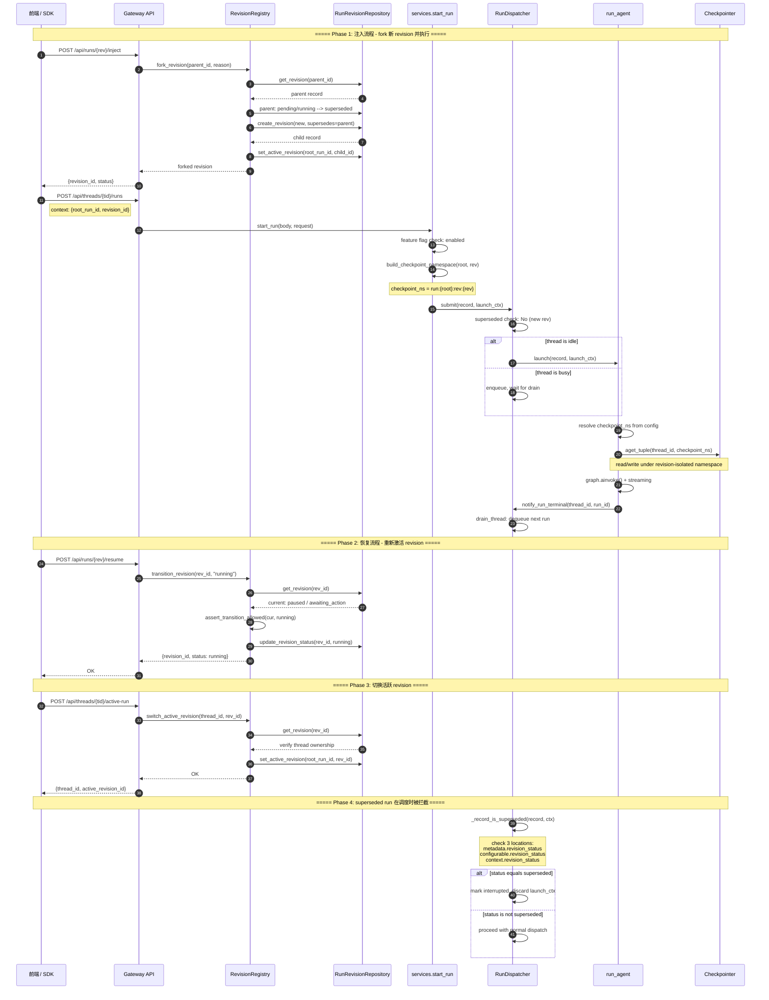

# DeerFlow Revision 架构 — 核心时序与改进总结

> 2026-06-05 | 基于 `develop/v0.01-20260605` 实现

## 1. 核心链路时序图



## 2. 核心链路说明

### 2.1 概念模型

```
Thread
  └── RootRun (一个 thread 可对应一个 root run)
        ├── Revision A (pending -> running -> superseded)
        │     └── checkpoint_ns = "run:root-1:rev:rev-a"
        ├── Revision B (pending -> running -> active)      <- 当前活跃
        │     └── checkpoint_ns = "run:root-1:rev:rev-b"
        └── Revision C (pending, 等待 future inject)
              └── checkpoint_ns = "run:root-1:rev:rev-c"
```

每个 revision 拥有独立的 checkpoint namespace，其状态历史与父 revision 隔离。

### 2.2 状态机

```
                    ┌──────────┐
                    │  pending │
                    └────┬─────┘
                         │
                    ┌────▼─────┐
              ┌─────│  running │─────┬──────────┬──────────┐
              │     └────┬─────┘     │          │          │
              │          │           │          │          │
     ┌────────▼──┐ ┌────▼─────┐ ┌───▼────┐ ┌───▼────┐ ┌───▼───┐
     │ awaiting  │ │  paused  │ │completed│ │cancelled│ │ error │
     │ _action   │ └────┬─────┘ └────────┘ └────────┘ └───────┘
     └─────┬─────┘      │          (终端)    (终端)     (终端)
           │            │
           └──► running ◄┘
                (可恢复)

     ┌─────────────┐
     │ superseded  │  <- 仅从 running/awaiting_action 进入
     └─────────────┘    (终端，不可逆)
```

### 2.3 Feature Flag 控制点

```
DEER_FLOW_REVISION_RUNTIME_ENABLED
  │
  ├─ 0 (default) -> checkpoint_ns = ""  <- 完全兼容旧行为
  │
  └─ 1           -> checkpoint_ns = "run:{root}:rev:{rev}"
                   + superseded 检测
                   + revision API 可用
```

### 2.4 关键路径速查

| 路径 | 入口 | 关键调用 |
|---|---|---|
| 注入 (Inject) | `POST /api/runs/{rev}/inject` | `Registry.fork_revision()` -> supersede parent -> create child -> set active |
| 恢复 (Resume) | `POST /api/runs/{rev}/resume` | `Registry.transition_revision(rev, "running")` -> 状态机校验 |
| 切换活跃 | `POST /api/threads/{tid}/active-run` | `Registry.switch_active_revision()` -> 校验 thread 归属 -> 更新 active |
| Run 创建 | `POST /api/threads/{tid}/runs` | `start_run()` -> 注入 checkpoint_ns -> Dispatcher.submit() |
| 调度 | (Dispatcher 内部) | `submit()` / `_drain_thread()` -> superseded 检测 -> 跳过或执行 |
| 执行 | (Worker 内部) | `run_agent()` -> 解析 checkpoint_ns -> 读写 checkpointer |
| 完成回调 | (Worker finally) | `notify_run_terminal()` -> Dispatcher._drain_thread() -> 出队下一个 |

## 3. 新旧架构对比

### 3.1 架构差异一览

| 维度 | 旧架构 | 新架构 |
|---|---|---|
| 调度单位 | Thread -> Run（扁平） | Thread -> RootRun -> Revision -> Run（分层） |
| checkpoint 隔离 | 无（所有 run 共享 `""` namespace） | 每个 revision 独立 namespace |
| 多轮协作 | 不支持 revision 分支 | inject -> fork + supersede；resume -> 恢复暂停 revision |
| 队列跳过 | 不支持 — 所有任务按序执行 | superseded 的 run 在 dispatch 时直接丢弃 |
| 状态管理 | 仅 Run 有状态 | Run + Revision 双层状态机 |
| 前端交互 | 无 revision 感知 | timeline、background panel、intent 识别 |
| 迁移安全 | — | 全部由 `DEER_FLOW_REVISION_RUNTIME_ENABLED` 守卫 |

### 3.2 旧架构数据流

```
Client -> POST /threads/{tid}/runs {input}
  -> start_run()
    -> checkpoint_ns = "" (硬编码)
    -> Dispatcher.submit()
      -> 若 thread 空闲 -> Worker.run_agent()
      -> 若 thread 忙 -> enqueue，等待前序 run 完成
```

### 3.3 新架构数据流

```
Client -> (判断 intent) ->
  ├─ inject -> POST /api/runs/{rev}/inject -> fork revision
  ├─ resume -> POST /api/runs/{rev}/resume -> transition revision
  └─ normal -> (直接创建 run)

-> POST /threads/{tid}/runs {context: {root_run_id, revision_id}}
  -> start_run()
    -> _revision_runtime_enabled()?
      ├─ Yes -> checkpoint_ns = "run:{root}:rev:{rev}"
      └─ No  -> checkpoint_ns = "" (legacy)
    -> Dispatcher.submit()
      -> _record_is_superseded?
        ├─ Yes -> 标记 interrupted，丢弃
        └─ No  -> 正常调度执行
```

### 3.4 代码变更热图

```
新增文件:
  backend/app/gateway/routers/revisions.py          <- 3 个 API endpoint
  backend/packages/.../runtime/revisions/            <- 核心逻辑层
    ├── schemas.py                                   <- RevisionStatus 枚举
    ├── state_machine.py                             <- 状态转移规则
    ├── registry.py                                  <- 编排层 (CRUD + fork)
    └── coordinator.py                               <- checkpoint_ns 构建
  backend/packages/.../persistence/run_revision/     <- 持久化层 (model + repo)
  backend/.../migrations/.../add_run_revision_tables <- DB migration
  backend/tests/test_revision_*.py                   <- 3 个测试文件
  frontend/src/core/revisions/                       <- hooks + api
  frontend/src/components/workspace/revisions/       <- timeline + background panel

修改文件 (核心):
  backend/app/gateway/services.py    <- +checkpoint_ns 注入 + feature flag
  backend/.../runtime/runs/worker.py <- checkpoint_ns 解析 (3 处 "" -> 动态)
  backend/.../runtime/runs/dispatcher.py <- +superseded 跳过逻辑
  backend/.../runtime/runs/manager.py    <- +queue 参数 + terminal handler
  backend/app/gateway/deps.py            <- +RevisionRegistry 依赖
  backend/app/gateway/app.py             <- +revisions router 注册
  frontend/src/core/threads/hooks.ts     <- +intent 识别 + inject/resume 分支
```

## 4. 关键改进点

### 4.1 零风险迁移

- `DEER_FLOW_REVISION_RUNTIME_ENABLED` 默认关闭
- 关闭时 `checkpoint_ns` 保持 `""`，与旧行为完全一致
- 开启后所有 revision 逻辑才生效

### 4.2 Superseded Run 不阻塞队列

旧架构中，如果注入产生新 revision，旧 revision 的 queued run 仍会执行。新架构在 `Dispatcher.submit()` 和 `_drain_thread()` 两处拦截 superseded 的 run，直接标记 `interrupted` 并丢弃，不消耗 worker 资源。

### 4.3 Checkpoint 命名空间隔离

Worker 不再硬编码 `checkpoint_ns = ""`，改为从 config 解析。每个 revision 拥有独立 namespace，checkpoint 不会跨 revision 污染。

### 4.4 防御性深度校验

Superseded 检测不仅在 `Dispatcher.submit()`（新提交），也在 `_drain_thread()`（从队列取出后）执行。即使 revision 在排队期间被 supersede，也不会被错误执行。

### 4.5 前后端协同

前端在发送消息前解析 `additionalKwargs` 中的 `intent` / `activeRevisionId`，在调用 LangGraph stream 之前先调用 revision API（inject/resume），确保 run 创建时携带正确的 revision 坐标。
