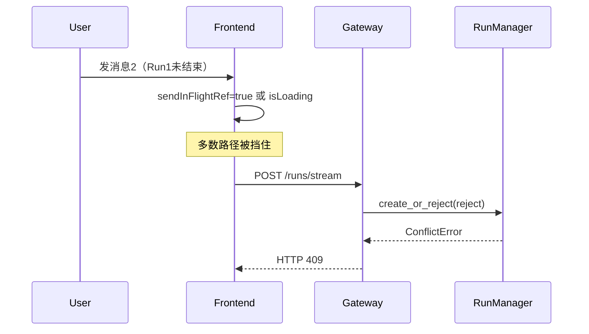
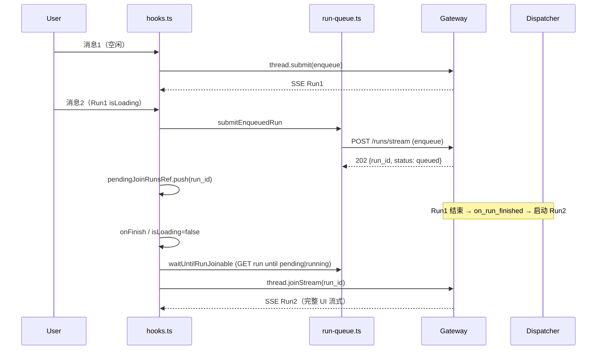
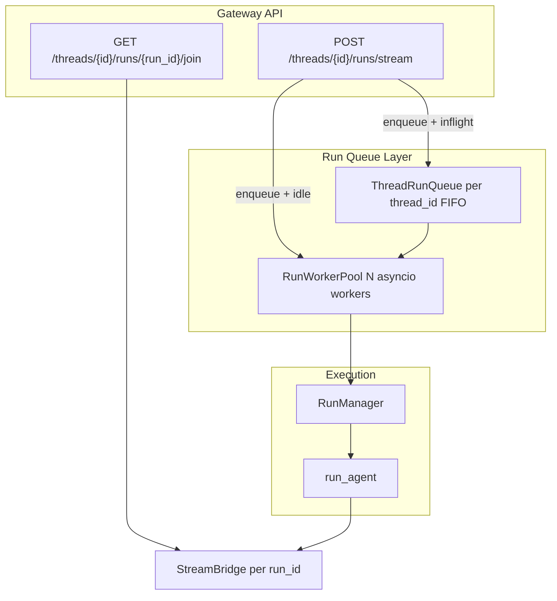

---

name: Thread Run Queue Workers
overview: 将 DeerFlow 从「同线程单 Run 锁会话」升级为「用户可持续发消息、消息入队、后台 Worker 池串行/并行处理」。分三阶段：Phase 1 实现 enqueue + 非阻塞前端（MVP）；Phase 2 全局 Worker 池；Phase 3（可选）同线程真并行需 checkpoint 隔离。
todos:

- id: task1-queued-status
content: "Task 1: Add RunStatus.queued enum + test"
status: completed
- id: task2-thread-queue
content: "Task 2: Create ThreadRunQueue (FIFO, max_depth)"
status: completed
- id: task3-enqueue-manager
content: "Task 3: RunManager.create_or_reject enqueue support"
status: completed
- id: task4-dispatcher
content: "Task 4: RunDispatcher worker pool + launch_run_task split"
status: completed
- id: task5-gateway-202
content: "Task 5: Gateway 202 response + join behavior + API docs"
status: completed
- id: task6-frontend
content: "Task 6: Frontend non-blocking submit + queue UI + E2E"
status: completed
- id: task6-queued-join
content: "Task 6 follow-up: drain pending runs + joinStream after 202 enqueue"
status: completed
- id: task7-8-hardening
content: "Task 7-8: Worker limits, metrics, channel adapter (Phase 2)"
status: completed
isProject: false

---

# Thread Run Queue & Background Workers Implementation Plan

> **For agentic workers:** REQUIRED SUB-SKILL: Use superpowers:subagent-driven-development (recommended) or superpowers:executing-plans to implement this plan task-by-task. Steps use checkbox (`- [ ]`) syntax for tracking.

**Goal:** 用户在同一会话中可持续发送消息；消息进入 per-thread 任务队列；后台 Worker 池消费队列并运行 Agent，不再因单个 Run 未完成而锁死输入或返回 409。

**Architecture:** 当前限制来自三层：`multitask_strategy=reject`（`[manager.py](backend/packages/harness/deerflow/runtime/runs/manager.py)` 409）、前端 `sendInFlightRef` + `await thread.submit()`（`[hooks.ts](frontend/src/core/threads/hooks.ts)`）、以及 LangGraph **同一 `thread_id` 共享一条 checkpoint 链**（不能无隔离地并行写状态）。MVP 采用 `**enqueue` 策略 + per-thread FIFO 队列 + 全局 asyncio Worker 池**：同线程 **串行** 执行 Run（保证 checkpoint/sandbox 正确），跨线程 **并行**（已有能力）。Queued Run 立即返回 `202` + `run_id`；Run 进入 `running` 后客户端通过已有 `[join_run](backend/app/gateway/routers/thread_runs.py)` / `GET .../runs/{run_id}/stream` 订阅 SSE。

**Tech Stack:** Python 3.12 / FastAPI / asyncio / LangGraph checkpointer / pytest；TypeScript / `@langchain/langgraph-sdk` / React Query

**Plan mirror:** `[.cursor/plans/thread_run_queue_workers_20298d67.plan.md](../../../../.cursor/plans/thread_run_queue_workers_20298d67.plan.md)`

---

## 实现状态（2026-06-04）

Phase 1（enqueue + 非阻塞前端）与 Phase 2（Worker 池）**已落地**。同线程多消息路径为：

1. Run1 流式进行中 → Run2 `POST /runs/stream` + `multitask_strategy=enqueue` → **202** + `run_id`
2. 前端将 `run_id` 写入 `pendingJoinRunsRef`，**不**阻塞输入
3. Run1 `onFinish` 且 `thread.isLoading === false` 后 → `waitUntilRunJoinable` → `thread.joinStream(runId)`
4. 多条排队 Run 按 FIFO 依次 drain（`drainPendingJoinRuns`）

**后续修复（同 Task 6）：** 初版仅 `submitEnqueuedRun` 入队，未 join 第二条 SSE，表现为「第二条只往下走了一步」。已在 `[hooks.ts](frontend/src/core/threads/hooks.ts)` + `[run-queue.ts](frontend/src/core/threads/run-queue.ts)` 补齐轮询与 `joinStream`。

---

## 现状与根因（改造前）




### 改造后：同线程连发两条消息




| 层级                   | 改造前                                   | 当前实现                                                                      |
| -------------------- | ------------------------------------- | ------------------------------------------------------------------------- |
| RunManager           | 仅 `reject` / `interrupt` / `rollback` | 支持 `enqueue`；inflight 时第二条为 `queued`                                      |
| 启动 Run               | Gateway 直接 `create_task`              | `RunDispatcher` 串行 per-thread + 全局 worker 上限                              |
| Gateway `stream_run` | 始终 SSE                                | `queued` → **202** JSON + `Content-Location`                              |
| Gateway `join_run`   | —                                     | `queued` → **409** + `queue_position`；`pending`/`running` → SSE           |
| 前端提交                 | `sendInFlightRef` 阻塞                  | `thread.isLoading` 时 `submitEnqueuedRun`；否则 `thread.submit(..., enqueue)` |
| 前端流订阅                | 仅首条 `submit` 流                        | 排队 Run：`drainPendingJoinRuns` → `joinStream`                              |
| 同线程并行                | 不安全（共享 checkpoint）                    | MVP **仍串行**；见 Phase 3                                                     |


**重要约束（写进设计文档）：**「多个 Worker」在 MVP 中指 **Worker 池可同时处理不同 thread 的 Run**；**同一 `thread_id` 默认仍串行**（一条 checkpoint 链）。若需同线程多 Run 真并行，见 Phase 3 follow-up（`checkpoint_ns=run_id` + UI 多流）。

---

## 目标架构




---

## File Structure


| File                                                                                                                                                     | Action     | Responsibility                                                                             |
| -------------------------------------------------------------------------------------------------------------------------------------------------------- | ---------- | ------------------------------------------------------------------------------------------ |
| `[backend/packages/harness/deerflow/runtime/runs/schemas.py](backend/packages/harness/deerflow/runtime/runs/schemas.py)`                                 | Modify     | 新增 `RunStatus.queued`                                                                      |
| `[backend/packages/harness/deerflow/runtime/runs/queue.py](backend/packages/harness/deerflow/runtime/runs/queue.py)`                                     | **Create** | per-thread FIFO + 入队/出队/位置查询                                                               |
| `[backend/packages/harness/deerflow/runtime/runs/dispatcher.py](backend/packages/harness/deerflow/runtime/runs/dispatcher.py)`                           | **Create** | 全局 Worker 池、Run 完成后 drain 下一项                                                              |
| `[backend/packages/harness/deerflow/runtime/runs/manager.py](backend/packages/harness/deerflow/runtime/runs/manager.py)`                                 | Modify     | `create_or_reject` 支持 `enqueue`；`on_run_terminal` 回调                                       |
| `[backend/app/gateway/services.py](backend/app/gateway/services.py)`                                                                                     | Modify     | 拆分 `launch_run_task`；queued Run 不立即 `create_task`                                          |
| `[backend/app/gateway/routers/thread_runs.py](backend/app/gateway/routers/thread_runs.py)`                                                               | Modify     | enqueue 时返回 202；queued run join 行为                                                         |
| `[backend/app/gateway/deps.py](backend/app/gateway/deps.py)`                                                                                             | Modify     | 注册 `RunDispatcher` 到 `app.state`                                                           |
| `[backend/tests/test_run_queue.py](backend/tests/test_run_queue.py)`                                                                                     | **Create** | 队列 + enqueue 集成测试                                                                          |
| `[frontend/src/core/threads/run-queue.ts](frontend/src/core/threads/run-queue.ts)`                                                                       | **Create** | `submitEnqueuedRun`、`fetchRun`、`waitUntilRunJoinable`、`countQueuedRuns`、`adjustQueueDepth` |
| `[frontend/src/core/threads/hooks.ts](frontend/src/core/threads/hooks.ts)`                                                                               | Modify     | 非阻塞 submit、`pendingJoinRunsRef`、`drainPendingJoinRuns`、`joinStream`                        |
| `[frontend/src/app/workspace/chats/[thread_id]/page.tsx](frontend/src/app/workspace/chats/[thread_id]/page.tsx)`                                         | Modify     | `queuedRunCount` badge                                                                     |
| `[frontend/src/app/workspace/agents/[agent_name]/chats/[thread_id]/page.tsx](frontend/src/app/workspace/agents/[agent_name]/chats/[thread_id]/page.tsx)` | Modify     | 同上（agent 会话页）                                                                              |
| `[frontend/tests/unit/core/threads/run-queue.test.ts](frontend/tests/unit/core/threads/run-queue.test.ts)`                                               | **Create** | 入队、轮询 joinable、depth 单元测试                                                                  |
| `[backend/docs/API.md](backend/docs/API.md)`                                                                                                             | Modify     | 文档化 `enqueue` + 202 响应                                                                     |
| `[docs/notes/多任务并行.md](docs/notes/多任务并行.md)`                                                                                                             | Modify     | 与实现对齐                                                                                      |


---

## Phase 1 — Enqueue + 非阻塞会话（MVP）

### Task 1: 新增 `RunStatus.queued`

**Files:**

- Modify: `[backend/packages/harness/deerflow/runtime/runs/schemas.py](backend/packages/harness/deerflow/runtime/runs/schemas.py)`
- Test: `[backend/tests/test_run_queue.py](backend/tests/test_run_queue.py)`
- **Step 1: Write the failing test**

```python
# backend/tests/test_run_queue.py
from deerflow.runtime.runs.schemas import RunStatus

def test_run_status_includes_queued():
    assert RunStatus.queued == "queued"
    assert "queued" in {s.value for s in RunStatus}
```

- **Step 2: Run test to verify it fails**

Run: `cd backend && uv run pytest tests/test_run_queue.py::test_run_status_includes_queued -v`  
Expected: FAIL — `AttributeError: queued`

- **Step 3: Add enum value**

```python
# schemas.py — inside class RunStatus
queued = "queued"
```

## **生命周期简图**

同 thread、multitask_strategy=enqueue

消息1（线程空闲）:  create → pending → running → success

消息2（Run1 还在跑）: create → queued →（Run1 结束）→ pending → running → ...

所以：`enqueue` **是策略；**`pending` **/** `queued` **是这条策略下、根据线程是否已有 inflight 选出来的状态。** 第 68 行断言 `pending` 是符合设计的。


- **Step 4: Run test — PASS**
- **Step 5: Commit**

```bash
git add backend/packages/harness/deerflow/runtime/runs/schemas.py backend/tests/test_run_queue.py
git commit -m "feat(runtime): add RunStatus.queued for enqueued runs"
```

---

### Task 2: `ThreadRunQueue` — per-thread FIFO

**Files:**

- Create: `[backend/packages/harness/deerflow/runtime/runs/queue.py](backend/packages/harness/deerflow/runtime/runs/queue.py)`
- Test: `[backend/tests/test_run_queue.py](backend/tests/test_run_queue.py)`
- **Step 1: Write failing tests**

```python
import pytest
from deerflow.runtime.runs.queue import ThreadRunQueue

@pytest.mark.anyio
async def test_enqueue_returns_position():
    q = ThreadRunQueue(max_depth=10)
    assert await q.enqueue("thread-a", "run-1") == 1
    assert await q.enqueue("thread-a", "run-2") == 2
    assert await q.position("thread-a", "run-2") == 2

@pytest.mark.anyio
async def test_dequeue_fifo_per_thread():
    q = ThreadRunQueue(max_depth=10)
    await q.enqueue("thread-a", "run-1")
    await q.enqueue("thread-a", "run-2")
    assert await q.dequeue("thread-a") == "run-1"
    assert await q.dequeue("thread-a") == "run-2"
    assert await q.dequeue("thread-a") is None

@pytest.mark.anyio
async def test_max_depth_raises():
    q = ThreadRunQueue(max_depth=2)
    await q.enqueue("t", "r1")
    await q.enqueue("t", "r2")
    with pytest.raises(OverflowError):
        await q.enqueue("t", "r3")
```

- **Step 2: Run — FAIL** (`ModuleNotFoundError`)
- **Step 3: Implement minimal queue**

```python
# backend/packages/harness/deerflow/runtime/runs/queue.py
from __future__ import annotations
import asyncio
from collections import deque
from dataclasses import dataclass, field

@dataclass
class ThreadRunQueue:
    max_depth: int = 50
    _lock: asyncio.Lock = field(default_factory=asyncio.Lock)
    _queues: dict[str, deque[str]] = field(default_factory=dict)

    async def enqueue(self, thread_id: str, run_id: str) -> int:
        async with self._lock:
            dq = self._queues.setdefault(thread_id, deque())
            if len(dq) >= self.max_depth:
                raise OverflowError(f"Thread {thread_id} run queue full (max={self.max_depth})")
            dq.append(run_id)
            return len(dq)

    async def position(self, thread_id: str, run_id: str) -> int | None:
        async with self._lock:
            dq = self._queues.get(thread_id)
            if not dq:
                return None
            try:
                return list(dq).index(run_id) + 1
            except ValueError:
                return None

    async def dequeue(self, thread_id: str) -> str | None:
        async with self._lock:
            dq = self._queues.get(thread_id)
            if not dq:
                return None
            run_id = dq.popleft()
            if not dq:
                self._queues.pop(thread_id, None)
            return run_id

    async def remove(self, thread_id: str, run_id: str) -> bool:
        async with self._lock:
            dq = self._queues.get(thread_id)
            if not dq:
                return False
            try:
                dq.remove(run_id)
            except ValueError:
                return False
            if not dq:
                self._queues.pop(thread_id, None)
            return True
```

- **Step 4: Run tests — PASS**
- **Step 5: Commit**

---

### Task 3: `RunManager.create_or_reject` 支持 `enqueue`

**Files:**

- Modify: `[backend/packages/harness/deerflow/runtime/runs/manager.py](backend/packages/harness/deerflow/runtime/runs/manager.py)` L497-579
- Modify: `[backend/packages/harness/deerflow/runtime/runs/queue.py](backend/packages/harness/deerflow/runtime/runs/queue.py)` — 注入 queue 依赖
- Test: `[backend/tests/test_run_queue.py](backend/tests/test_run_queue.py)`

**行为规格：**

- `enqueue` + **无 inflight** → 创建 `pending` Run（与 today 相同，由 dispatcher 立即启动）
- `enqueue` + **有 inflight** → 创建 `queued` Run，**不**设置 `abort_event`，入队，返回 record
- inflight 定义：`pending` 或 `running`（**不含** `queued`）
- 队列满 → `OverflowError` → Gateway `429`
- **Step 1: Write failing test**

```python
@pytest.mark.anyio
async def test_enqueue_second_run_becomes_queued():
    from deerflow.runtime.runs.manager import RunManager
    from deerflow.runtime.runs.queue import ThreadRunQueue
    from deerflow.runtime.runs.schemas import RunStatus

    queue = ThreadRunQueue(max_depth=10)
    mgr = RunManager(queue=queue)

    first = await mgr.create_or_reject("thread-1", multitask_strategy="enqueue")
    first.status = RunStatus.running  # simulate active run

    second = await mgr.create_or_reject("thread-1", multitask_strategy="enqueue")
    assert second.status == RunStatus.queued
    assert await queue.position("thread-1", second.run_id) == 1
```

- **Step 2: Run — FAIL**
- **Step 3: Implement** — 扩展 `_supported_strategies`，`RunManager.__init__(queue: ThreadRunQueue | None = None)`，`enqueue` 分支设置 `RunStatus.queued` 并 `queue.enqueue`
- **Step 4: Run tests — PASS**
- **Step 5: Commit**

---

### Task 4: `RunDispatcher` — Worker 池 + 完成后 drain

**Files:**

- Create: `[backend/packages/harness/deerflow/runtime/runs/dispatcher.py](backend/packages/harness/deerflow/runtime/runs/dispatcher.py)`
- Modify: `[backend/app/gateway/services.py](backend/app/gateway/services.py)`
- Modify: `[backend/packages/harness/deerflow/runtime/runs/worker.py](backend/packages/harness/deerflow/runtime/runs/worker.py)` — `finally` 调用 `dispatcher.on_run_finished(thread_id, run_id)`
- Test: `[backend/tests/test_run_queue.py](backend/tests/test_run_queue.py)`

**接口：**

```python
class RunDispatcher:
    def __init__(self, *, workers: int, queue: ThreadRunQueue, launch: LaunchRunCallable): ...

    async def start(self) -> None: ...          # spawn N worker loops
    async def stop(self) -> None: ...

    async def submit(self, record: RunRecord, launch_ctx: LaunchContext) -> None:
        """If thread idle → launch immediately; else if queued → wait for worker."""

    async def on_run_finished(self, thread_id: str, run_id: str) -> None:
        """Dequeue next run_id for thread and launch."""
```

`**launch_run_task` 拆分**（从 `[start_run](backend/app/gateway/services.py)` 抽出）：

- `prepare_run(...)` — 校验 model、create_or_reject、thread meta
- `launch_run_task(record, launch_ctx)` — `asyncio.create_task(run_agent(...))` 并赋 `record.task`
- **Step 1: Test — 两个 enqueue Run 顺序执行**

```python
@pytest.mark.anyio
async def test_dispatcher_runs_queued_runs_serially_per_thread():
    launched: list[str] = []
    async def fake_launch(record, _ctx):
        launched.append(record.run_id)
        record.status = RunStatus.running
        await asyncio.sleep(0)
        record.status = RunStatus.success

    # ... construct dispatcher, enqueue two runs, assert launched order
```

- **Step 2-5: Implement + wire in gateway lifespan** (`[deps.py](backend/app/gateway/deps.py)` L129+)
- **Config** — 在 `[config.example.yaml](config.example.yaml)` 增加：

```yaml
runs:
  queue:
    max_depth_per_thread: 50
  workers: 4   # global concurrent run_agent tasks
```

---

### Task 5: Gateway HTTP — enqueue 返回 202

**Files:**

- Modify: `[backend/app/gateway/routers/thread_runs.py](backend/app/gateway/routers/thread_runs.py)` L146-171
- Modify: `[backend/app/gateway/services.py](backend/app/gateway/services.py)`
- Test: `[backend/tests/test_run_queue_http.py](backend/tests/test_run_queue_http.py)`（可复用 `[test_setup_agent_http_e2e_real_server.py](backend/tests/test_setup_agent_http_e2e_real_server.py)` 的 auth 模式）

**响应规则：**


| 条件               | 状态码     | Body                                  |
| ---------------- | ------- | ------------------------------------- |
| Run 立即 `running` | 200     | SSE stream（现状）                        |
| Run `queued`     | **202** | JSON `RunResponse` + `queue_position` |
| 队列满              | 429     | detail                                |


- **Step 1: HTTP test** — 连续两次 POST，第二次 202 + `status: "queued"`
- **Step 2: Implement** — `stream_run` 检查 `record.status == RunStatus.queued` 时返回 JSONResponse 202 而非 StreamingResponse
- **Step 3: `join_run`** — queued run 返回 409 + `Retry-After` 或 200 空 SSE 直到 running（推荐：**409 + `{status:"queued", position}`** 让客户端轮询 `GET /runs/{run_id}`）
- **Step 4: Commit + update `[API.md](backend/docs/API.md)`**

---

### Task 6: 前端 — 非阻塞提交 + 队列 UI ✅

**Files:**

- Create: `[frontend/src/core/threads/run-queue.ts](frontend/src/core/threads/run-queue.ts)`
- Modify: `[frontend/src/core/threads/hooks.ts](frontend/src/core/threads/hooks.ts)`
- Modify: `[frontend/src/app/workspace/chats/[thread_id]/page.tsx](frontend/src/app/workspace/chats/[thread_id]/page.tsx)`
- Modify: `[frontend/src/app/workspace/agents/[agent_name]/chats/[thread_id]/page.tsx](frontend/src/app/workspace/agents/[agent_name]/chats/[thread_id]/page.tsx)`

**已实现行为：**


| #   | 行为                                                                                              | 实现位置                                             |
| --- | ----------------------------------------------------------------------------------------------- | ------------------------------------------------ |
| 1   | 移除 `sendInFlightRef`；每条消息独立 optimistic id                                                       | `useThreadStream` / `sendMessage`                |
| 2   | 空闲：`thread.submit(..., { multitaskStrategy: "enqueue" })` → 直接 SSE                              | `hooks.ts` `else` 分支                             |
| 3   | 流式中：`submitEnqueuedRun`（raw `fetch` + CSRF）→ 202 入 `pendingJoinRunsRef`                         | `hooks.ts` `if (thread.isLoading)`               |
| 4   | Run1 结束后：`waitUntilRunJoinable`（`status !== queued` 且 `pending`/`running`）→ `thread.joinStream` | `drainPendingJoinRuns`                           |
| 5   | 多条排队：FIFO drain；`onFinish` 与 `isLoading` effect 触发下一轮                                           | `pendingJoinRunsRef` + `drainPendingJoinRunsRef` |
| 6   | UI：`queuedRunCount` badge；每 2s `countQueuedRuns` 与服务端对齐                                         | `page.tsx` + `hooks.ts` effect                   |
| 7   | 切线程：清空 `pendingJoinRunsRef` / `queuedRunCount`                                                  | `useEffect([threadId])`                          |


`**run-queue.ts` 公共 API：**

- `submitEnqueuedRun(threadId, body)` — `POST .../runs/stream`，body 强制 `multitask_strategy: "enqueue"`；202 → `{ kind: "queued", runId, queuePosition }`，200 → `{ kind: "streaming", runId }`（从 `Content-Location` 解析）
- `fetchRun` / `waitUntilRunJoinable` — 轮询直至可 join（默认 100ms × 600 ≈ 60s）
- `THREAD_RUN_STREAM_MODES` — `["values", "messages-tuple", "custom"]`，与 submit/join 一致
- `countQueuedRuns` / `adjustQueueDepth` — UI 深度

**已知限制（未做）：**

- Stop 按钮仍只作用于**当前** `useStream` 绑定的 running run；queued run 单独 cancel 依赖既有 `POST .../runs/{id}/cancel`（UI 未单独暴露）
- E2E「连发两条 + 第二条完整流式」用例仍待补（`chat.spec.ts`）
- **Step 1: Unit test** — `[run-queue.test.ts](frontend/tests/unit/core/threads/run-queue.test.ts)`（`adjustQueueDepth`、`submitEnqueuedRun`、`waitUntilRunJoinable`）
- **Step 2: E2E** — 扩展 `[frontend/tests/e2e/chat.spec.ts](frontend/tests/e2e/chat.spec.ts)`：连发两条，第二条 SSE 完整、非仅 optimistic
- **Step 3-5: Implement** — 含 202 后 `joinStream` 修复

---

## Phase 2 — 全局 Worker 池调优（生产化）

### Task 7: 并发限制与公平调度

**Files:**

- Modify: `[backend/packages/harness/deerflow/runtime/runs/dispatcher.py](backend/packages/harness/deerflow/runtime/runs/dispatcher.py)`
- 全局 semaphore `workers`（默认 4）
- per-user 可选上限（从 `get_effective_user_id()`）
- 指标：queue depth、wait time、active workers（log + 可选 `/metrics`）

### Task 8: Channel 适配

**Files:**

- Modify: `[backend/app/channels/manager.py](backend/app/channels/manager.py)` L782 — Slack/DingTalk 从 `multitask_strategy="reject"` 改为 `enqueue`

---

## Phase 3 — Follow-up（同线程真并行，**不在 MVP**）

若产品要求「同一会话里多条消息 **同时** 跑 Agent」：


| 子系统          | 必要改动                                                             |
| ------------ | ---------------------------------------------------------------- |
| Checkpointer | 每 Run 使用 `configurable.checkpoint_ns = run_id`；合并消息需显式 reconcile |
| Sandbox      | 文件锁 / run 级 workspace 子目录                                        |
| ThreadState  | `messages` 不能多 writer 无协调；需 run-scoped 输出再 merge                 |
| Frontend     | 多 SSE 流、多 AI bubble、`run_id` 绑定消息                                |
| API          | 新策略 `multitask_strategy: "parallel"`                             |


**建议：** MVP 交付后再单独立项；与 enqueue 队列正交。

---

## 测试矩阵


| 场景                    | 命令 / 类型                                                              |
| --------------------- | -------------------------------------------------------------------- |
| 单元：队列 FIFO            | `pytest backend/tests/test_run_queue.py -v`                          |
| 单元：enqueue 409→202    | 同上                                                                   |
| HTTP：双 POST           | `pytest backend/tests/test_run_queue_http.py -v`                     |
| 回归：interrupt/rollback | `pytest backend/tests/test_run_manager.py -v`                        |
| 前端单元                  | `cd frontend && pnpm test tests/unit/core/threads/run-queue.test.ts` |
| 手动回归                  | 同会话 Run1 流式中发 Run2 → Run2 应完整流式（非仅 optimistic / 单步）                  |
| E2E（待补）               | `cd frontend && pnpm test:e2e chat.spec.ts`                          |


---

## Self-Review（spec coverage）


| 需求               | 对应 Task                                      | 状态               |
| ---------------- | -------------------------------------------- | ---------------- |
| 用户持续发消息          | Task 6 移除 sendInFlight 阻塞                    | ✅                |
| 消息进入任务队列         | Task 2-4 ThreadRunQueue + enqueue            | ✅                |
| 后台多个 Worker      | Task 4/7 RunDispatcher worker pool           | ✅                |
| 不再锁死会话           | Task 5 202 + Task 6 非阻塞 UI                   | ✅                |
| 排队 Run 前端可订阅 SSE | Task 6 `drainPendingJoinRuns` + `joinStream` | ✅（2026-06-04 修复） |
| 同线程安全            | MVP 串行；Phase 3 并行                            | ✅ 设计约束保持         |


---

## 实现记录


| 日期             | 变更                                                                  |
| -------------- | ------------------------------------------------------------------- |
| Phase 1–2      | 后端 `queued`、`ThreadRunQueue`、`RunDispatcher`、Gateway 202、`enqueue`  |
| Phase 1 Task 6 | 前端非阻塞提交、`run-queue.ts`、队列 badge                                     |
| 2026-06-04     | 修复第二条消息：入队后 `waitUntilRunJoinable` + `thread.joinStream`；单元测试覆盖轮询逻辑 |


**验证：** 刷新后同 thread 连发两条；Network 可见第二条 `POST .../runs/stream` → 202，Run1 结束后 `GET .../runs/{id}/join`（或 SDK 等价 join）→ SSE。